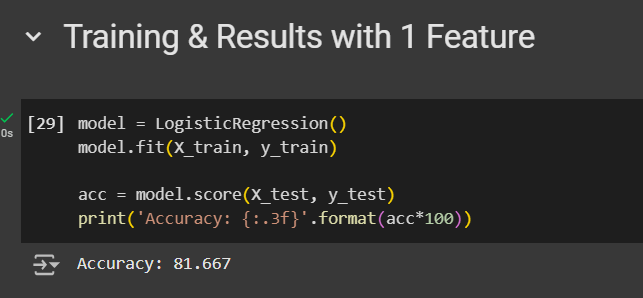
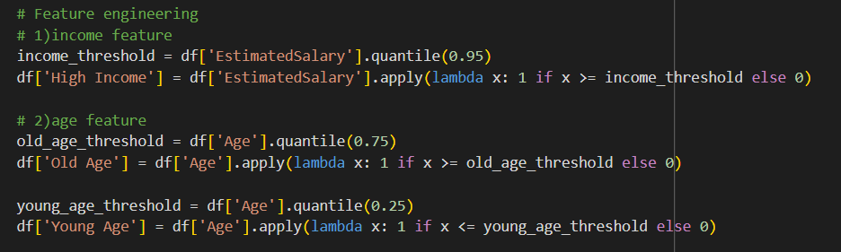
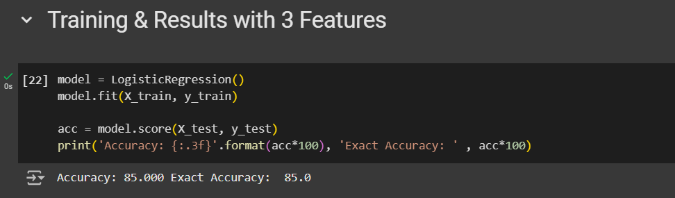

# Feature-Engineering
the impact of features on the accuracy of the model:
let's start with no features and see the results of the model on raw data :

now let's see if adjusting features can impact the accuracy of the model :
here we choose one feature to add to the model and train it !

we choose income as the first feature to add to the model

the accuracy of the model improved from 80% to 81.667%

here we choose three feature to add to the model and train it !

the accuracy of the model improved from 81.667% to 85%

==> Conclusion :
Feature engineering significantly impacts the accuracy of the model. Starting with raw data, the model achieved an accuracy of 80%. By iteratively adding features, we observed the following improvements:

Adding income as the first feature increased the accuracy to 81.667%.
Including three features further boosted the accuracy to 85%.
This demonstrates that selecting and incorporating relevant features can enhance the predictive power of the model, highlighting the importance of thoughtful feature engineering in machine learning workflows.